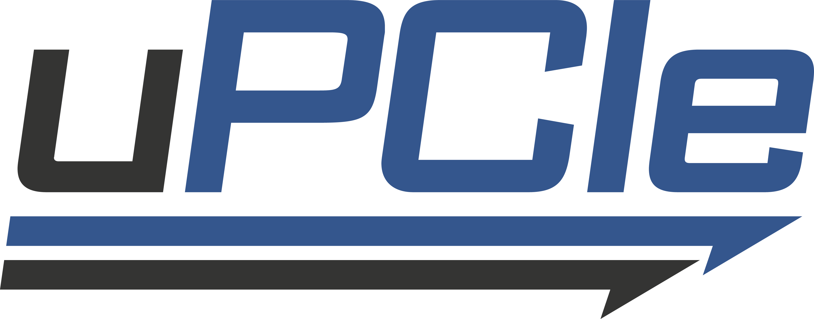

uPCIe: user-space PCIe libraries
================================

uPCIe is a set of header-only C libraries for user-space PCIe device interaction
on Linux. It provides hugepage-backed DMA, MMIO accessors, PCI discovery and BAR
mapping, VFIO wrappers, dma-buf helpers, and a minimalist NVMe driver, with no
dependencies beyond the Linux UAPI headers.

It started as a way to explore the boundary between safe and unsafe user-space
PCIe practices. It targets both the IOMMU-protected path (``vfio-pci``) and the
raw-physical path (``uio_pci_generic`` with hugepages). The companion tooling
lives in its own repositories: `devbind <https://github.com/xnvme/devbind>`_,
`hugepages <https://github.com/xnvme/hugepages>`_, and
`iommu <https://github.com/safl/iommu>`_.

Design goals
------------

- **Header-only**
- **Idiomatic**, with a consistent error and ownership model
- **Zero-dependency**, beyond the Linux UAPI headers
- **Minimalistic**
- **Low-coupling**
- **C11**

Topics of interest
------------------

- Mapping PCIe BAR spaces via ``vfio-pci`` and ``uio_pci_generic``
- IOMMU-protected memory for safe DMA
- Hugepages for raw-physical DMA with ``uio_pci_generic``
- PCIe driver binding and unbinding
- Interrupts and how to handle them

Documentation
-------------

The documentation is published at https://safl.dk/upcie. The sources live under
``docs/`` and build locally with::

    make -C docs deps
    make -C docs html      # output in docs/_build/html
